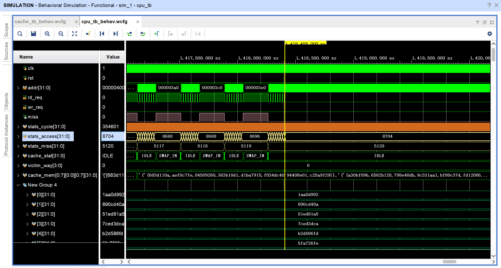
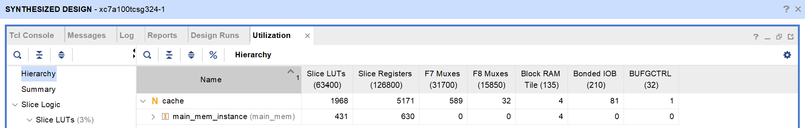

# Verilog-Lab3 实验报告

<strong>彭浩然 PB19051055</strong>

[TOC]

## 测试方法

我们选择换入策略、块地址长度、组地址长度和组相联度四个维度对cache进行调整，对每一组参数进行综合，记录其消耗的Slice LUTs、Slice Registers和F7 Muxes三种资源，并在快速排序和矩阵乘法两个样例上进行仿真，记录缺失率和时钟周期数。

下图为仿真界面，其中`stats_access`表示访问次数，`stats_miss`表示缺失次数，`stats_cycle`表示时钟数。记录最后稳定的访问次数和缺失次数，并且按最后一次访问的时刻记录时钟数。

下图为综合后的资源利用率界面。

我们选取块地址长度、组地址长度和组相联度分别为3、3、2的参数为基准，针对每一个维度测试时，只改变这个维度的参数。最终，我们将分析每一个维度的作用，并且给出综合性能优秀的参数集。

## 针对组相联度和换入策略的评估

由于换入策略在组相联度高时才能显现出差别，所以我们将这两个参数一起测试。得到的结果如下：

| 换入策略 | 块地址长度 | 组地址长度 | 组相联度 | Slice LUTs | Slice Registers | F7 Muxes | 快排缺失率 | 快排周期数 | 矩阵乘法缺失率 | 矩阵乘法周期数 |
| -------- | ---------- | ---------- | -------- | ---------- | --------------- | -------- | ---------- | ---------- | -------------- | -------------- |
| FIFO     | 3          | 3          | 1        | 1125       | 3051            | 294      | 5.95%      | 70620      | 58.82%         | 354601         |
| LRU      | 3          | 3          | 1        | 1145       | 3054            | 294      | 5.95%      | 70620      | 58.82%         | 354601         |
| FIFO     | 3          | 3          | 2        | 1972       | 5189            | 591      | 2.21%      | 47429      | 55.88%         | 340777         |
| LRU      | 3          | 3          | 2        | 1968       | 5171            | 589      | 2.10%      | 46687      | 53.68%         | 330409         |
| FIFO     | 3          | 3          | 4        | 4963       | 9399            | 1119     | 1.02%      | 39478      | 19.98%         | 171975         |
| LRU      | 3          | 3          | 4        | 4996       | 9403            | 1199     | 1.18%      | 40486      | 15.42%         | 145285         |
| FIFO     | 3          | 3          | 8        | 7694       | 17824           | 2627     | 0.63%      | 36413      | 1.68%          | 73643          |
| LRU      | 3          | 3          | 8        | 7754       | 17856           | 2631     | 0.63%      | 36413      | 1.38%          | 72551          |

随着组相联度的提高，硬件消耗变大，两个测试样例的缺失率和周期数都在下降。快排从一开始缺失率就不高，而矩阵乘法由于数据量本身比较大，缺失率下降非常明显。增加组相联度来增大cache的尺寸是非常细粒度的，它对各种情况都有较好的优化效果，但是硬件资源（尤其是组合逻辑资源Muxes）消耗比较大。

通常情况下，换入策略LRU比FIFO消耗稍微多一些硬件资源，并且性能有可见的提升。因此，后面的测试中我们将统一使用LRU。

## 针对块地址长度的评估

| 换入策略 | 块地址长度 | 组地址长度 | 组相联度 | Slice LUTs | Slice Registers | F7 Muxes | 快排缺失率 | 快排周期数 | 矩阵乘法缺失率 | 矩阵乘法周期数 |
| -------- | ---------- | ---------- | -------- | ---------- | --------------- | -------- | ---------- | ---------- | -------------- | -------------- |
| LRU      | 2          | 3          | 2        | 1167       | 2754            | 271      | 6.62%      | 72218      | 54.78%         | 335601         |
| LRU      | 3          | 3          | 2        | 1968       | 5171            | 589      | 2.10%      | 46687      | 53.68%         | 330409         |
| LRU      | 4          | 3          | 2        | 4113       | 10029           | 1067     | 0.60%      | 37449      | 10.03%         | 125195         |
| LRU      | 5          | 3          | 2        | 8523       | 19753           | 1866     | 0.16%      | 34793      | 6.41%          | 107791         |

块地址长度每增加1，cache尺寸增加一倍。增加块地址长度相当于增加line的长度，是粗粒度的增大cache方式。这种方式消耗的组合逻辑资源较少，时序逻辑资源比增加组相联度要多。在快排缺失率上比增加组相联度优秀，因为到最后其实快排的所有数据都被加载进了cache，而line更长可以在一次换入时多加载进来一些数据，所以也就降低了缺失率。然而，针对矩阵乘法，并不是所有数据都能被载入，粗粒度的换入可能导致有用数据同时被换出，因此效果不如增加组相联度。

## 针对组地址长度的评估

| 换入策略 | 块地址长度 | 组地址长度 | 组相联度 | Slice LUTs | Slice Registers | F7 Muxes | 快排缺失率 | 快排周期数 | 矩阵乘法缺失率 | 矩阵乘法周期数 |
| -------- | ---------- | ---------- | -------- | ---------- | --------------- | -------- | ---------- | ---------- | -------------- | -------------- |
| LRU      | 3          | 2          | 2        | 1993       | 3067            | 64       | 3.83%      | 57354      | 53.68%         | 330409         |
| LRU      | 3          | 3          | 2        | 1968       | 5171            | 589      | 2.10%      | 46687      | 53.68%         | 330409         |
| LRU      | 3          | 4          | 2        | 3716       | 9365            | 1116     | 1.15%      | 40275      | 13.32%         | 140655         |
| LRU      | 3          | 5          | 2        | 7949       | 17723           | 2164     | 0.63%      | 36413      | 8.32%          | 116333         |

组地址长度每增加1，cache尺寸增加一倍。增加组数事实上也增加了并行比较的器件，所以组合逻辑器件消耗比较大。但是因为组和组之间并不互通，这种方法的灵活度也很有限。在这两个样例上，增加组地址长度的优化效果不如前面两种方式。

## 推荐的参数

根据上面的分析，我们给出两组推荐的参数：

| 换入策略 | 块地址长度 | 组地址长度 | 组相联度 | Slice LUTs | Slice Registers | F7 Muxes | 快排缺失率 | 快排周期数 | 矩阵乘法缺失率 | 矩阵乘法周期数 |
| -------- | ---------- | ---------- | -------- | ---------- | --------------- | -------- | ---------- | ---------- | -------------- | -------------- |
| LRU      | 4          | 3          | 4        | 9170       | 18339           | 1883     | 0.31%      | 35333      | 0.64%          | 68263          |
| LRU      | 4          | 3          | 2        | 4113       | 10029           | 1067     | 0.60%      | 37449      | 10.03%         | 125195         |

第一组参数既通过增加块地址长度来简单扩增cache尺寸，又通过增大组相联度使cache有更细的粒度，在两个测试样例上都有相比单一维度扩大更优秀的性能。对于硬件资源不紧迫、追求极致性能的场景来说，这种策略更加合适。

第二组参数只增加了块地址长度。在硬件资源较紧张的情况下，这种策略可以粗粒度地用较少的硬件资源换取矩阵乘法样例速度的大幅度提升（接近基准参数三倍）。
