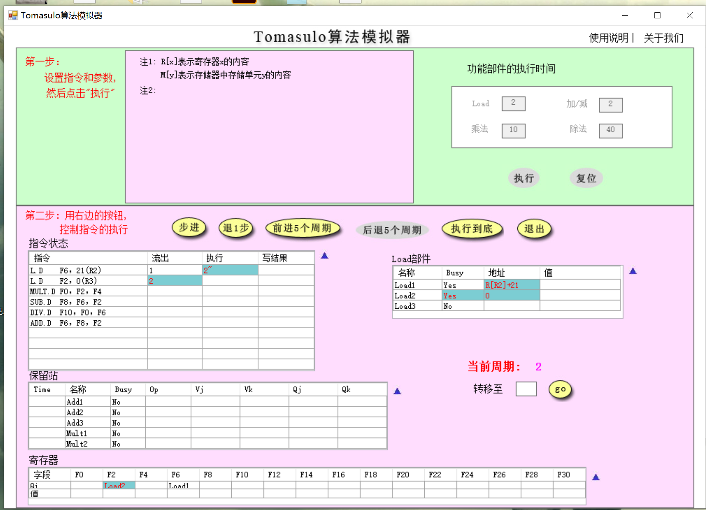
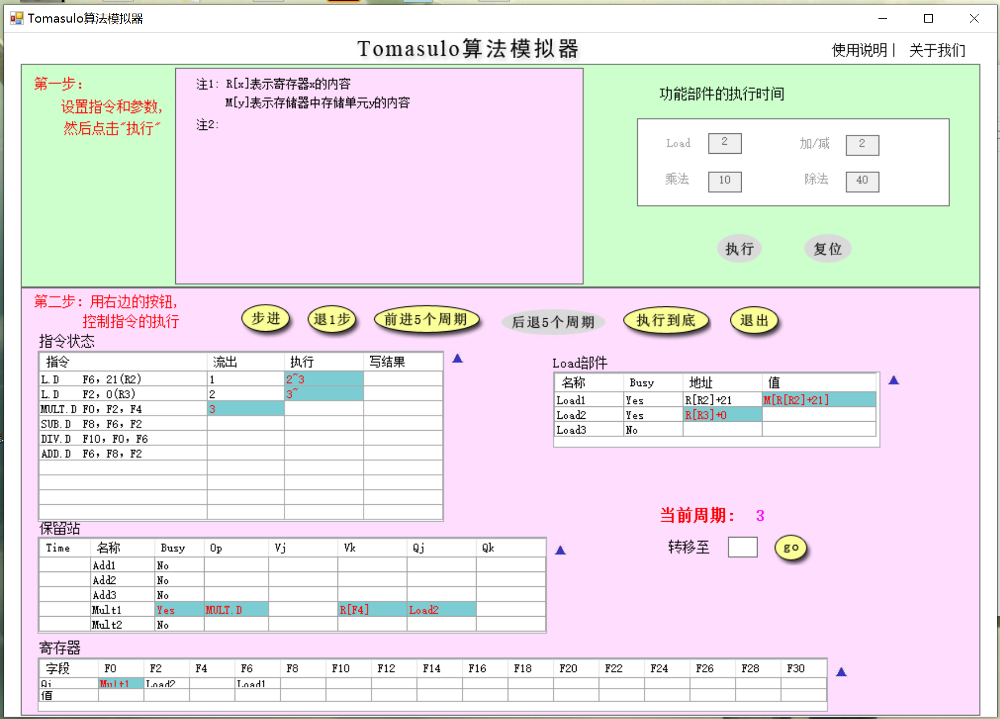
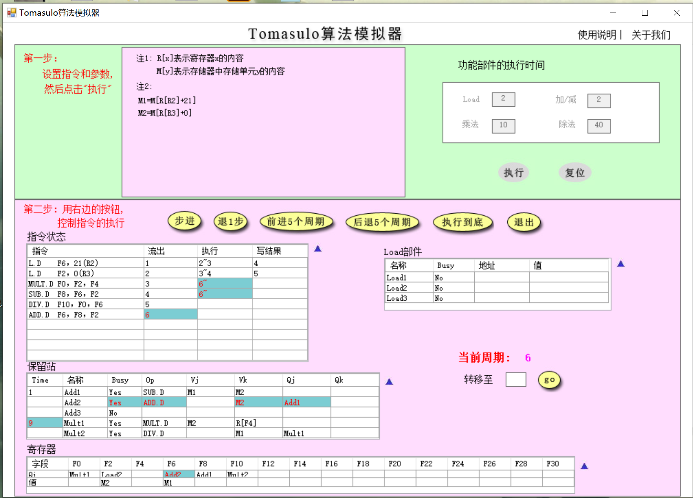
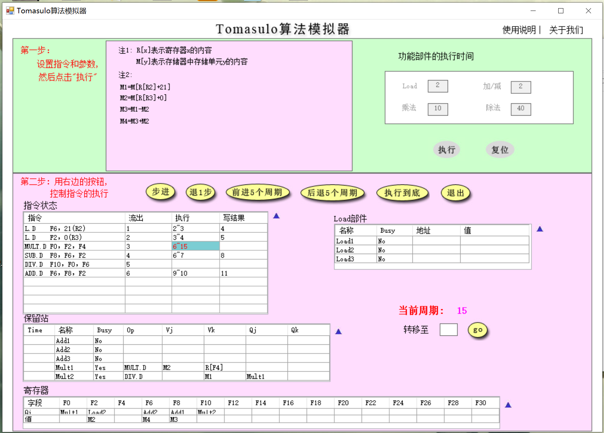
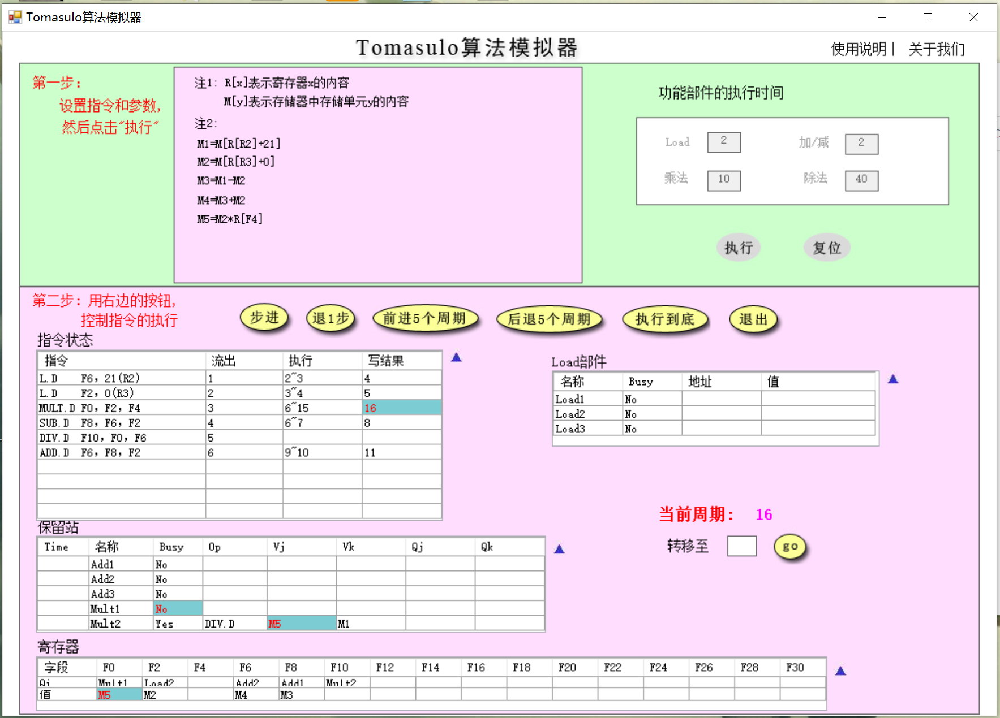
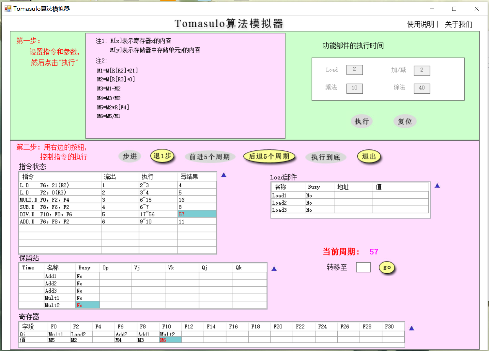
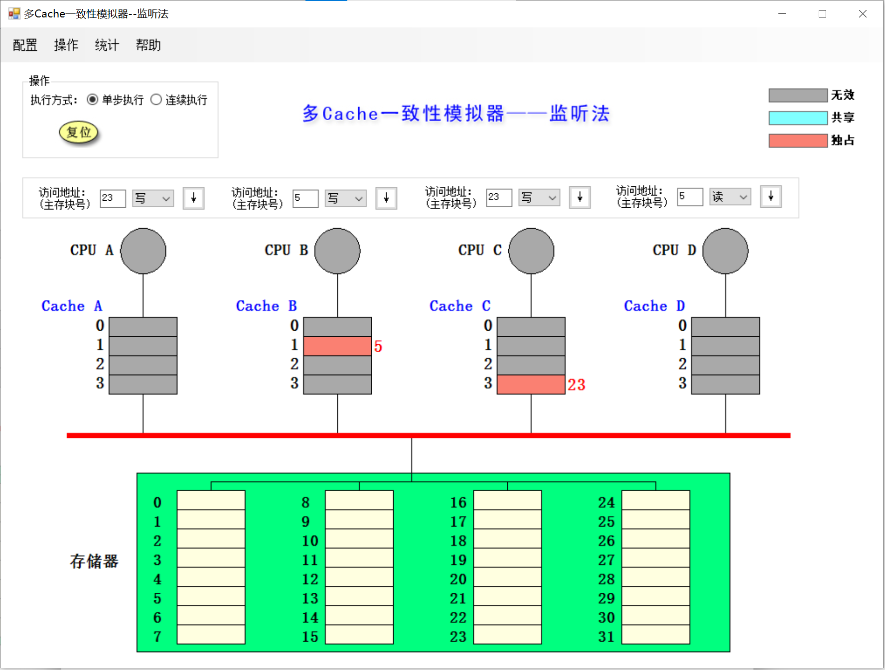
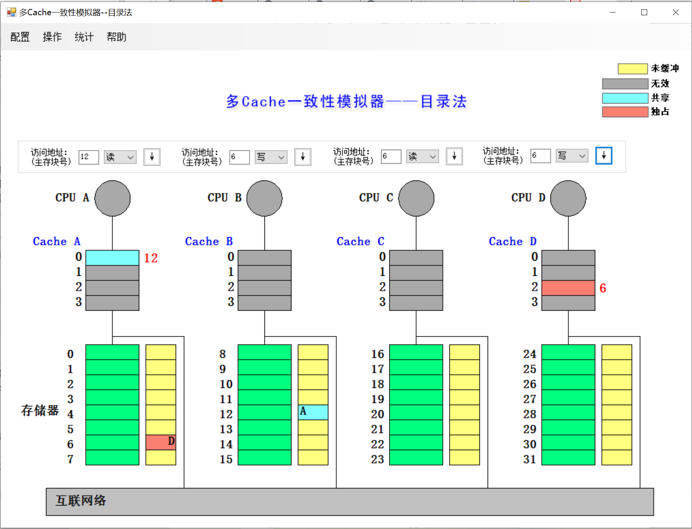

# Verilog-Lab6 实验报告

<strong>彭浩然 PB19051055</strong>

[TOC]

## Tomasulo算法模拟器

### 第1题

> 分别截图（当前周期2和当前周期3），请简要说明load部件做了什么改动

Load1部件已经取得了`M[R[R2]+21]`的值，下一周期可供第1条指令写结果；第2条指令刚刚进入执行阶段，所以Load2部件得到了`R[R3]+0`的地址，准备进行访存。

### 第2题

> 请截图（MUL.D刚开始执行时系统状态），并说明该周期相比上一周期整个系统发生了哪些改动（指令状态、保留站、寄存器和Load部件）

指令状态：第3、4条指令进入执行阶段，第6条指令刚刚流出。

保留站：Add2为第6条指令的任务保留，Busy设为yes，根据第6条指令`ADD.D F6, F8, F2`，Add2的Op设为ADD.D，Vk设为M2（即`M[R[R3]+0]`），Qj设为Add1。Mult1获得了操作数，开始执行，Time被设为9。

寄存器：作为第6条指令的写结果地址，F6的Qi设为Add2，值仍然是第1条指令所读取的M1。

Load部件：没有工作。

### 第3题

> 简要说明是什么相关导致MUL.D流出后没有立即执行

是RAW相关，`MULT.D`所需的操作数`F2`由需要等待第2条指令写结果。

### 第4题

> 请分别截图（15周期和16周期的系统状态），并分析系统发生了哪些变化

`MULT.D`刚刚完成写结果，解除对Mult1部件的占用，`F0`的值被写为M5，同时该值也被Mult2记录在保留站中，作为第5条指令的操作数。

### 第5题

> 回答所有指令刚刚执行完毕时是第多少周期，同时请截图（最后一条指令写CBD时认为指令流执行结束）

所有指令刚刚执行完毕是第57周期。

## 多cache一致性算法-监听法

### 第1题

> 利用模拟器进行下述操作，并填写下表

| **所进行的访问** | **是否发生了替换？** | **是否发生了写回？** | **监听协议进行的操作与块状态改变**                           |
| ---------------- | -------------------- | -------------------- | ------------------------------------------------------------ |
| CPU A 读第5块    | 是                   | 否                   | A发送读不命中事务，读取第5块，状态变为共享                   |
| CPU B 读第5块    | 是                   | 否                   | B发送读不命中事务，读取第5块，状态变为共享                   |
| CPU C 读第5块    | 是                   | 否                   | C发送读不命中事务，读取第5块，状态变为共享                   |
| CPU B 写第5块    | 否                   | 否                   | B发送写作废事务，A和C的第5块变为无效，B的第5块变成独占       |
| CPU D 读第5块    | 是                   | 是                   | D发送读不命中事务，B写回第5块，状态变为共享，D读取第5块，状态变为共享 |
| CPU B 写第21块   | 是                   | 否                   | B发送写不命中事务，读取第21块，状态变为独占                  |
| CPU A 写第23块   | 是                   | 否                   | A发送写不命中事务，读取第23块，状态变为独占                  |
| CPU C 写第23块   | 是                   | 是                   | C发送写不命中事务，A写回第23块，状态变为无效，C读取第23块，状态变为独占 |
| CPU B 读第29块   | 是                   | 是                   | B写回第21块，发送读不命中事务，读取第29块，状态变为共享      |
| CPU B 写第5块    | 是                   | 是                   | B发送写不命中事务，读取第5块，状态变为独占，D的第5块变为无效 |

### 第2题

> 请截图，展示执行完以上操作后整个cache系统的状态。

## 多cache一致性算法-目录法

### 第1题

> 利用模拟器进行下述操作，并填写下表

| **所进行的访问** | **目录协议进行的操作与块状态改变**                           |
| ---------------- | ------------------------------------------------------------ |
| CPU A 读第6块    | A发送读不命中事务，读取第6块，存储器状态改变为共享，记录A为共享者 |
| CPU B 读第6块    | B发送读不命中事务，读取第6块，存储器记录B为共享者            |
| CPU D 读第6块    | D发送读不命中事务，读取第6块，存储器记录D为共享者            |
| CPU B 写第6块    | B写第6块，发送写命中事务，存储器状态改变为B独占，向A、D发送作废事务，A、D状态改变为无效 |
| CPU C 读第6块    | C发送读不命中事务，存储器向B发送读取事务，B写回第6块，状态改变为共享，存储器向C发送第6块，记录B、C为共享者 |
| CPU D 写第20块   | D发送写不命中事务，存储器向D发送第20块，记录D为独占者，D写第20块 |
| CPU A 写第20块   | A发送写不命中事务，存储器向D发送读取并作废事务，D向存储器发送第20块并变为无效装填，存储器向A发送第20块，记录A为独占者，A写第20块 |
| CPU D 写第6块    | D发送写不命中事务，存储器向B、C发送作废事务，B、C第6块变为无效状态，存储器向D发送第6块，并记录D为独占者，D写第6块 |
| CPU A 读第12块   | A发送写回并修改共享集事务，并向存储器发送第20块，存储器第20块变为未缓冲状态，A发送读不命中事务，存储器向A发送第12块，并记录A为共享者 |

### 第2题

> 请截图，展示执行完以上操作后整个cache系统的状态。

## 综合问答

### 第1题

> 目录法和监听法分别是集中式和基于总线，两者优劣是什么？（言之有理即可）

监听法在较小的共用总线型机器上简单而易于实现，但在处理器数目增大时总线的竞争会增多，可扩放性受到一定限制，同时，监听法在非总线或环的网络上进行监听比较困难。

目录法的状态控制较复杂，需要记录的信息也更多，但是存储器对块状态的集中管理可以有效地增强可扩放性，适配非总线或环状网络，实现更大规模的分布式共享存储器体系结构。

### 第2题

> Tomasulo算法相比Score Board算法有什么异同？（简要回答两点：1.分别解决了什么相关，2.分别是分布式还是集中式）（参考第五版教材）

Scoreboard算法是一种集中式的动态指令流调度算法，它的基本思想是允许stall后的指令继续向前流动，通过允许乱序执行、乱序完成的方法，解决了顺序发射流水线被结构相关阻塞的问题。然而，对于WAR和WAW这两种伪相关，Scoreboard算法依然需要停滞。

Tomasulo算法是一种分布式的动态指令流调度算法，在Scoreboard已经解决结构相关的基础上，它通过寄存器重命名的方法进一步解决了WAR和WAW相关。

### 第3题

> Tomasulo算法是如何解决结构、RAW、WAR和WAW相关的？（参考第五版教材）

结构相关：Tomasulo算法中每一个功能部件都有自己的保留站，登记即将或正在这个功能部件上运行的指令，因此避免了不同类型指令的结构相关。

RAW相关：Tomasulo算法中存在定向路径，传给功能部件的数据从保留站中传来，而保留站可以直接从CDB中获取数据，这样就避免了RAW相关中需要等待写寄存器的问题。

WAR和WAW相关：Tomasulo算法使用寄存器重命名机制，将指令中的寄存器在保留站中改为用寄存器值或者指向产生这个操作数的保留站的指针代替，避免了WAR和WAW相关。
